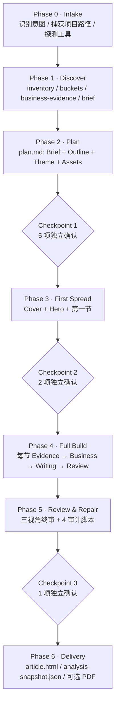
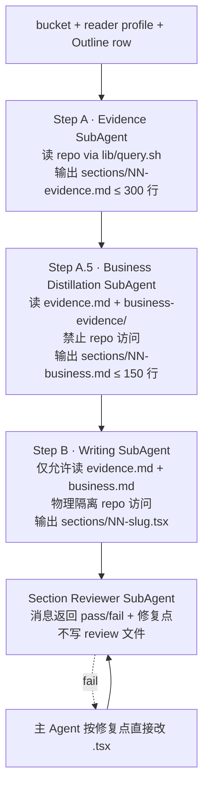

# beautiful-codebase 使用流程手册 (v0.1.0)

> 本手册是把"读完一份代码项目并产出一份漂亮的分析报告"这件事拆解成可执行步骤的完整指南。
> 如果你只是想快速上手，看 [README 的"快速开始"](../README.md#快速开始) 够了。
> 本手册补的是 **每个步骤具体怎么做、AI 会问你什么、出错怎么排查**。

**适配版本**：StarCodex v0.1.0 / `beautiful-codebase` 0.1.0
**对应 skill 入口**：[`skills/beautiful-codebase/SKILL.md`](../skills/beautiful-codebase/SKILL.md)

---

## 目录

- [0. 前置条件](#0-前置条件)
- [1. 流程总览](#1-流程总览)
- [2. Phase 0 · Intake](#2-phase-0--intake-启动)
- [3. Phase 1 · Discover](#3-phase-1--discover-扫描)
- [4. Phase 2 · Plan + Checkpoint 1](#4-phase-2--plan--checkpoint-1)
- [5. Phase 3 · First Spread + Checkpoint 2](#5-phase-3--first-spread--checkpoint-2)
- [6. Phase 4 · Full Build](#6-phase-4--full-build-三阶段写作)
- [7. Phase 5 · Review & Repair + Checkpoint 3](#7-phase-5--review--repair--checkpoint-3)
- [8. Phase 6 · Delivery](#8-phase-6--delivery)
- [9. 故障排除](#9-故障排除)
- [10. 与其它 AI 编码客户端的对接](#10-与其它-ai-编码客户端的对接)
- [11. 进阶](#11-进阶)
- [12. 参考资料](#12-参考资料)

---

## 0. 前置条件

### 0.1 系统环境

- **Git** —— skill 用 `git ls-files` 做 inventory 兜底、用 `git log` 抽 commit themes。
- **Node.js 18+** —— `scripts/scaffold.sh` 创建的报告 workspace 是 Vite + React + TypeScript 工程，构建用 `npm run build`。Node 16 会卡在 `vite@5` 上。
- **AI 编码客户端** —— Claude Code / Cursor / Codex CLI / opencode / Gemini CLI 任一。客户端必须能：
  - 读本仓库下的 markdown 与脚本文件；
  - 运行 bash 子进程（PDF 导出、审计脚本需要）；
  - 支持 SubAgent 分发（强烈建议，否则 Phase 4 的"三阶段写"退化为同一个 Agent 串行执行；不致命但风格容易跑偏）。
- **操作系统** —— macOS / Linux / Windows (Git Bash / MSYS2)。Windows 下的 PDF 导出存在已知 path 问题，见 §9.4。

### 0.2 工具链（三档，任一皆可）

beautiful-codebase 内部的 `scripts/lib/query.sh` 封装了三档工具回退；`scripts/probe-tools.sh` 在 Phase 0 末尾自动探测可用档位并写到 `discovery/tools.json`。

| 档位 | 工具                                       | 安装                                                     | 备注 |
|----|------------------------------------------|--------------------------------------------------------|----|
| 1  | **codegraph**（推荐 · 1.0.1+）              | 参见 codegraph 官方安装；本仓库 dogfood 用的是 1.0.1               | 提供符号级查询 / callers / callees；语义精度最高 |
| 2  | **rg**（ripgrep · 15+）                    | `brew install ripgrep` / `apt install ripgrep` / `winget install BurntSushi.ripgrep.MSVC` | 文本级查询；速度快；符号查询退化为关键字 |
| 3  | **grep**                                 | macOS / Linux 自带；Windows 走 Git Bash                    | 兜底；速度慢、精度低，但能跑就行 |

skill 自动优先用 codegraph；装得越全，Section 03 / 05 / 07 等依赖符号 / 入口分析的章节精度越高。tier 不影响**报告形态**，只影响**精度**——低 tier 的报告里相关章节会显式标 "工具 tier=rg / grep" 与"可能漏报"。

**关键提醒：codegraph 决不会被静默执行 `codegraph init`**。如果当前项目没有 `.codegraph/`，skill 在 Phase 0 会停下问你三件事（运行 init / 降级到 rg / 暂停手动跑），详见 §2.3。

### 0.3 Chromium-family 浏览器（仅 PDF 导出需要）

`scripts/html-to-pdf.sh` 探测系统已安装的 chromium 系列浏览器之一即可：

- Google Chrome
- Microsoft Edge
- Chromium

检测顺序见脚本顶部；找不到任何一个就 fail-fast。如果只交付 HTML 不需要 PDF，跳过此项。

### 0.4 仓库本身的准备

- 把 StarCodex 仓库 clone 到 AI 客户端能读到的本机位置。
- 在你的 AI 客户端里"挂载"`skills/beautiful-codebase/` —— 各客户端做法见 §10。
- 准备**待分析的目标项目路径**。skill 不会自己挑项目，必须由你显式给路径。

---

## 1. 流程总览



- **6 个 Phase**：从识别意图到交付，机器化推进。
- **3 个硬 Checkpoint**：必须停下来问用户，**不允许 Agent 静默替选**（skill 称之为"决策收集铁律"，源出 [`SKILL.md` 铁律 6](../skills/beautiful-codebase/SKILL.md#硬性质检协议贯穿整个-skill)）。
- **隐式 Checkpoint**：Phase 0 末尾的 codegraph init 决策（当目标项目未索引时）。
- **状态文件**：所有 Phase 间的决策都落 `<project>-analysis/` 工作区的磁盘文件——不依赖聊天上下文记决策，会话被截断也不丢。

---

## 2. Phase 0 · Intake (启动)

### 2.1 怎么触发 skill

在 AI 客户端里说任意一条触发词都会进入 `beautiful-codebase`：

| 中文                  | English                                       |
|---------------------|-----------------------------------------------|
| 分析这个代码库            | analyze this codebase                         |
| 给这个项目做一份分析报告       | build a beautiful codebase report             |
| 给我一个项目架构总览         | generate an architecture review of this repo  |
| 帮我写一份代码归档          | make a single-file HTML report for this project |
| 我要交接这个项目           | reacticle codebase report                     |

触发词与 skill 边界（"什么场景**不**进 skill"）的完整定义在 [`SKILL.md` § 边界](../skills/beautiful-codebase/SKILL.md#边界先判断要不要进这个-skill)。当你的请求像 "重构这个模块" / "做个 dashboard 看代码指标" / "写个新功能"，skill 应该**拒绝进入**并请你澄清——遇到这种被退回的情况，那是设计而非 bug。

### 2.2 skill 会问的事

进入 Phase 0 后，skill 会向你确认下面这些前提（详细 6 问在 [`references/harness.md` § 1](../skills/beautiful-codebase/references/harness.md)）：

1. **目标项目路径** —— 绝对 / 相对 / "当前目录" 都接受；但**必须给**，skill 不会自己挑。
2. **工作区位置** —— 默认 `./<project-name>-analysis/`（在你调用 shell 的当前目录，**不写进目标项目**）。可自由文本覆盖，例如 "放在 `.beautiful-codebase/` 里"。
3. **目标语言** —— 用户没说时默认 **中文 prose + 英文标识符**：解释 / 业务背景 / 评注用中文；文件路径 / 类名 / 方法名 / API 名 / 命令 / 错误信息 verbatim 英文不翻译。明确说"全英文"或"双语"会被记进 plan.md。
4. **（可选）git remote** —— skill 自动 `git remote get-url origin` 抓 owner/repo + 当前 SHA，用于 Phase 4 Source Pointers 渲染可点击的 GitHub URL；抓不到也没事，退化成纯文本 `file:line`。
5. **工具 tier** —— Phase 0 末尾自动跑 `scripts/probe-tools.sh`，把 codegraph / rg / grep 检测结果落到 `discovery/tools.json`。

**Phase 0 自检**：四件事齐了才能进 Phase 1。

```
✓ 用户要的是报告，不是改代码
✓ 目标项目路径已捕获
✓ 工作区路径不会误写进目标项目
✓ git remote / 目标语言 / 工具 tier 已记入决策
```

### 2.3 codegraph 未索引时的 3 选项

这是 Phase 0 最重要的隐式 Checkpoint。`probe-tools.sh` 探测后会出现三种状态：

| 探测结果                                           | tier                  | skill 行为 |
|------------------------------------------------|-----------------------|----------|
| `.codegraph/` 已存在                              | `codegraph-indexed`    | 悄悄进 Phase 1，不打扰用户 |
| codegraph 已装但 `.codegraph/` 不存在                | `codegraph-installed`  | **停下来问你 3 选项**（见下） |
| codegraph 未装 / 仅 rg                            | `rg`                   | 直接进 Phase 1，提示精度从语义级退化为文本级 |
| 仅 grep                                         | `grep`                 | 进 Phase 1，提示精度会进一步下降 |

当 tier = `codegraph-installed` 时，skill 会 **逐字** 发这段：

```
目标项目没有 codegraph 索引（.codegraph/ 不存在）。要让分析最准确，
建议现在跑一次 codegraph init（约 30 秒到几分钟，会向项目写一个
.codegraph/ 目录）。请选：

  A · 现在跑 codegraph init（推荐 · 精度最高）
  B · 不用，降级到 rg（更快，精度略降）
  C · 我自己稍后跑，到时再回来；现在停下
```

**铁律**：`codegraph init` **属于 medium-risk 写**（向目标项目落盘），决不静默执行。你不选完，skill 不会动手。

> 💡 选 A 后，记得在交付完报告后跑一次 `codegraph uninit .` 清理（或把 `.codegraph/` 加进目标项目的 `.gitignore`），否则 `git status` 会一直挂着这个未跟踪目录。本仓库 dogfood 中 v0.2 follow-up F1 就提到这点。

---

## 3. Phase 1 · Discover (扫描)

Phase 1 由 `scripts/discover/*.sh` 一组脚本驱动，**没有 SubAgent**——它们都是机器写的，主 Agent 通读自查即可。详细规则在 [`references/discover.md`](../skills/beautiful-codebase/references/discover.md)。

### 3.1 `inventory.json` 是什么

`discovery/inventory.json` 是整套 skill 的"真值集"——后续所有 Section、Coverage Audit、Freshness Audit 都拿它做参照。结构：

```json
{
  "snapshot": "2026-06-21T07:30:00Z",
  "files": [
    {
      "path": "src/foo/bar.go",
      "language": "go",
      "bytes": 4231,
      "sha": "abc123...",
      "excluded_reason": null
    },
    {
      "path": "vendor/lib/x.js",
      "language": "javascript",
      "bytes": 89421,
      "sha": "...",
      "excluded_reason": "vendored"
    }
  ]
}
```

**生成方式**：

- tier = `codegraph-indexed` → 优先 `codegraph files`（实际 v0.1.0 因 codegraph CLI 1.0.1 不支持 `--json` 子命令而走 fallback；见 v0.2 F3）。
- 其它 tier → `git ls-files` + `file --mime` 推断语言。

**自检**：`inventory.json` 里**每个文件路径都必须存在于 repo 里**（不允许编造路径）；后面 Plan Outline 提到的每个模块名也必须出现在 inventory 里。

### 3.2 桶分档规则

按文件总数分四档（写入 `discovery/tier.json`），决定 Phase 2 Outline 的章节弹性、Phase 4 桶切分粒度、Phase 5 Coverage Audit 的硬度。

| size tier  | 文件数              | bucket 策略             | 影响 |
|------------|------------------|-----------------------|----|
| `<100`     | < 100 个文件         | 单一 bucket            | reader profile 自由选；Coverage 强制 100% |
| `100-1k`   | 100 – 1 000 个文件   | 按目录切，每桶 ~5k LOC | reader profile 自由选；Coverage 强制 100% |
| `1k-10k`   | 1 000 – 10 000 个文件 | 按目录 + 模块切，~5k LOC / 桶  | 推荐 archaeology；Coverage 仍要求 100% |
| `>10k`     | > 10 000 个文件      | 双层切（先按顶级目录分组，再按模块切） | **强制** reader profile 降级到 archaeology · ~70%；Coverage Annex 强制开启；report footer **禁止**声称 100% coverage |

`>10k` 的"诚实规则"是 honesty rule，目的是让大项目的报告**不假装自己读完了**——把没读到的文件诚实列进 Coverage Annex。

### 3.3 business-evidence 6 个文件

`discovery/business-evidence/` 下 6 个证据文件是 Phase 4 Step A.5（业务蒸馏）的**唯一燃料**——没有它们，业务段只能瞎编。采集规则在 [`references/business-evidence-collection.md`](../skills/beautiful-codebase/references/business-evidence-collection.md)。

| 文件                  | 来源                                                                   | 用途 |
|---------------------|----------------------------------------------------------------------|----|
| `comments.jsonl`    | 源码中的注释（业务关键词过滤后的 doc / block 注释）                                       | 找业务规则陈述 |
| `tests.jsonl`       | 测试用例的 `describe` / `it` / `t.Run` 名称                                  | 业务场景命名是测试用例最准的来源 |
| `schema.md`         | DB schema / migration / DDL 文件                                       | 业务实体定义（最权威） |
| `configs.md`        | 关键配置文件（feature flag / routing / role / quota …）                       | 业务策略 |
| `docs.md`           | `README*` / `CHANGELOG*` / `CONTRIBUTING*` / `docs/**.md`             | 项目级业务陈述 |
| `commit-themes.md`  | `git log --pretty` 的 conventional commit type 聚合                       | 半年节奏的业务方向 |

> 已知缺陷（v0.2 F4）：v0.1.0 中 `business-evidence.sh` 写 `docs.md` 时会扫**全部 inventory 文件**，把 `.gitignore` / `LICENSE` / `banner.png` 都混进去（包括二进制字节）。手动跑完后建议先看一眼 `docs.md` 顶部，删掉非 markdown 噪声再让 AI 进入 Phase 2。

### 3.4 codebase-brief.md 是 Plan 阶段的入口

`discovery/codebase-brief.md` 是 ~200 行的项目速览，**主 Agent 进 Phase 2 第一件事就是读它**。它包含：

- 语言占比 / 总 LOC / 文件分布
- top 模块（按 LOC / 文件数）
- 提交节奏 / 主要贡献者
- 关键入口文件（main / cmd / index / Application class）
- 主要依赖 / 框架推断

这份文件是给**人读**的，也是给主 Agent 写 plan.md 时心里有数的素材。

### 3.5 排除规则

`inventory.sh` 会用 `excluded_reason` 字段标注下列文件为"不计入分析"（但仍在 inventory 里以便 Coverage Audit 知道有这些路径）：

- **vendored**：`vendor/` / `node_modules/` / `third_party/` / `external/` 下的文件
- **generated**：明显的 codegen 产物（`*.pb.go` / `*_generated.ts` / `dist/` / `build/` 出物）
- **fixtures**：测试夹具 / 数据样例 / 二进制图片

排除文件**不会**被 Phase 4 evidence 抓，但 Coverage Annex 里仍会标"vendored / generated / fixtures"分类显示。

---

## 4. Phase 2 · Plan + Checkpoint 1

Phase 2 是"形成编辑方案，不写 HTML"。**只产出一份 `plan/plan.md`**。模板在 [`references/plan-template.md`](../skills/beautiful-codebase/references/plan-template.md)，自查清单在 [`references/review-checklist.md` § 1](../skills/beautiful-codebase/references/review-checklist.md)。

### 4.1 Plan 模板

`plan/plan.md` 是 4 段固定结构 + 业务-Job 行：

```markdown
# Plan · <Project Name>

## Brief
- reader profile: architecture-review (~80%)
- 标配信息保留比例: 80%
- 必须保留: <列点 5–10 条；plan 的"承诺清单"，Editorial Reviewer 会逐条对照>
- 可删减: <列点>
- 语气 / 主要观点 / 阅读目标
- 目标语言: 中文 prose + 英文标识符
- 版式宽度: regular
- TOC: on
- 配图策略: none (mermaid 主视觉)
- 工具 tier: codegraph-indexed
- size tier: 1k-10k
- git remote: github.com/owner/repo @ <sha>

## Outline
| # | 名称 | bucket | 业务-Job | 必须保留 | 视觉 |
|---|---|---|---|---|---|
| 01 | Verdict | bucket-00 | 给 senior eng 30 分钟做"值不值得继续投入"判断 | 整体风险评级、3 条结构性论断 | 徽章 |
| 02 | Project at a Glance | bucket-00 | 同上 | 语言占比、入口、规模 | 表格 + LOC bar |
| 02b | Business Domain Map | bucket-business | 业务实体关系一图 | 5 个核心业务实体 | mermaid graph LR |
| ... | ... | ... | ... | ... | ... |

## Theme
- 选定: terminal
- 理由: code-native / 暗底等宽 / 语义状态色契合 architecture-review
- v0.1.0 限制: terminal 主题在 reacticle 0.2.6 中尚未导出（见 v0.2 F2），实际渲染会走 tufte fallback

## Assets
- 默认 none
- 仅 Cover 与 Section 07 复杂度热图允许 SVG
```

### 4.2 三种 reader profile 怎么选

reader profile 是 Checkpoint 1 第 1 个独立确认项；它**打包决定**了"必选 / 可选 Section 的清单 + 标配信息保留比例 + 视觉密度 + 默认主题 + Source Pointers 默认折叠状态 + Plan 自检对'业务-Job'的严格度"。三种 profile 在 [`references/profiles/`](../skills/beautiful-codebase/references/profiles/) 下分别有详档：

| Profile                  | 使命                                              | 必选 Section                                                       | 标配保留              | 默认主题              |
|--------------------------|-------------------------------------------------|----------------------------------------------------------------|-------------------|-------------------|
| `architecture-review`    | 给 senior eng / 架构师 30 分钟判断"值不值得继续投入 / 哪里有结构性风险" | Cover · 01 Verdict · 02b Business Domain · 03 Architecture Map · 04 Module Walk · 08 Risks · 11 Coverage Annex · 12 Colophon | ~80%              | terminal          |
| `onboarding`             | 今天读完，明天 ship 第一个 issue                            | Cover · 01 What this codebase does · 02 Project at a Glance · 04 Module Walk · 05 Entry Points · 12 Colophon | ~65%              | terminal · 也合 press |
| `archaeology`            | 交接 / 归档 / 半年后还能找回决策                            | Cover · 01 Verdict · 02 Project at a Glance · 02b Business Domain · 03 Architecture Map · 04 Module Walk · 08 Risks · 09 Decisions That Matter · 11 Coverage Annex · 12 Colophon | ~100%（>10k 时强制 ~70%） | terminal · 也合 tufte |

**选择启发**：

- 选 `architecture-review`：你或下游消费者是技术领导 / 架构评审委员会 / 投资方技术尽调。
- 选 `onboarding`：报告的目标读者是即将加入项目的工程师，需要"明天上手"。
- 选 `archaeology`：项目要交接或归档，过几个月也许没人维护，但报告必须能让继任者复原决策。

### 4.3 主题：terminal vs tufte vs press

主题是 Checkpoint 1 第 2 个独立确认项。详档：[`references/theme-selection.md`](../skills/beautiful-codebase/references/theme-selection.md) + [`theme-profiles/*.md`](../skills/beautiful-codebase/theme-profiles/)。

| 主题       | 气质           | 适合场景               | 备注 |
|----------|--------------|--------------------|----|
| terminal | 暗底等宽 / 语义状态色 / code-native | 代码分析报告（默认推荐）       | **v0.1.0 已知限制**：reacticle 0.2.6 published 包未导出 `terminal` 主题枚举（v0.2 F2），scaffold 会过 tsc 失败。临时方案：用 tufte 起步，等 reacticle 0.3.x 发布 |
| tufte    | 学术 / 高白底 / 衬线 + 等宽混排 | 证据密集的研究 / 内审报告       | terminal 不可用时的稳定替代 |
| press    | CMS / 内容编辑系统风格    | 偏内容业务的项目（CMS / 营销内容平台） | 项目偏编辑系统时换 |

### 4.4 Checkpoint 1 的 5 项独立确认

**铁律：禁止把多项决策打包成一个 "全选我推荐的？" yes/no**——这等于剥夺你选择的机会。AI 可以推荐，但每项必须独立确认。

| #  | 决策项     | 选项                                                          | 默认推荐 |
|----|---------|-------------------------------------------------------------|------|
| 1  | reader profile | `architecture-review · ~80%` / `onboarding · ~65%` / `archaeology · ~100%`（>10k 时 ~70%） | architecture-review |
| 2  | 主题      | `terminal` / `tufte` / `press`                              | terminal（受 v0.2 F2 阻塞时退回 tufte） |
| 3  | 版式宽度   | `narrow` / `regular` / `wide` / `full`                      | regular |
| 4  | 配图模式（必选 · 不允许"默认通过"） | `none` / `user-assets` / `placeholders` / `ai-generated` | none（本 skill 用 mermaid 做主视觉） |
| 5  | 封面     | `开` / `关`                                                  | 开（默认 Cover 是屏幕 3:4 + PDF 独占首页，详见 [`references/cover.md`](../skills/beautiful-codebase/references/cover.md)） |

确认方式优先 `AskQuestion` 工具（每项一个 question 卡）；无该工具时 AI 会在消息里**编号列出 5 个问题、停下等答复**。**5 项全部收齐后才能进 Phase 3**。

> 📌 **如果你想"偏离 profile 标配保留比例"**：直接在答案里写"architecture-review 但只要 50%"，AI 会写进 plan.md Brief 段。

### 4.5 信息保留比例与 profile 的对应

"信息保留比例"是 Editorial Reviewer 在 Phase 5 用来核对 plan 与成品对照的关键数字——它不是逐字数 / 逐段数的硬指标，而是个软目标。

| profile               | 标配 | 含义 |
|----------------------|----|----|
| architecture-review  | 80% | 砍掉细节，保留结构性论断 + 关键风险 + 模块概览 |
| onboarding           | 65% | 进一步砍，只留新人 ship 第一个 issue 真正需要的脉络 |
| archaeology          | 100% | 几乎不砍；>10k 项目强制 70% 以保 honesty |

Phase 5 Editorial Reviewer 会用 `plan.md` Brief 的"必须保留"清单逐条核对成品是否真的有该信息。

---

## 5. Phase 3 · First Spread + Checkpoint 2

Phase 3 是首屏样张阶段：**封面（若开） + 首屏（Hero / Lead / TOC） + 第一节** + First Spread Reviewer 自检。脚手架在这一步落地。

### 5.1 First Spread 是什么

"First Spread"指报告打开后的视觉第一印象 + 第一节作为后续节模板锚点。**第一节走完整三阶段**（Evidence → Business Distillation → Writing），它的风格、节奏、节脚 `<SourcePointers>` 折叠面板的写法，会被后续所有节复用。

Phase 3 入口的脚手架命令：

```bash
# 默认 (封面开)
bash skills/beautiful-codebase/scripts/scaffold.sh ./<project>-analysis --theme=terminal

# Checkpoint 1 用户选了"封面 · 关"
bash skills/beautiful-codebase/scripts/scaffold.sh ./<project>-analysis --theme=terminal --no-cover

# 列出可用主题
bash skills/beautiful-codebase/scripts/scaffold.sh --list-themes
```

scaffold 一键创建 Vite + React + TypeScript 工作区，从 npm 安装最新发布版 reacticle，并写出 `discovery/ plan/ review/` 记忆目录骨架 + `article/Article.tsx` assembler + 示例 section 组件 + 默认 `article/Cover.tsx`（除非 `--no-cover`）。

**注意**：scaffold 不会覆盖已存在的 `discovery/` 子目录里的真实数据；若你之前已经跑过 Phase 1，scaffold 前先 `mv discovery /tmp/backup`，scaffold 后再 `cp -r /tmp/backup/* discovery/`（v0.2 F9 在追这个 ergonomic 问题）。

### 5.2 Cover 设计指南

封面是 Checkpoint 1 第 5 项的产物。架构在 [`references/cover.md`](../skills/beautiful-codebase/references/cover.md) 详述。硬约束：

- **比例**：屏幕 3:4 + PDF 独占首页，外壳不可动。
- **图文并茂**：截掉文字层还剩视觉主体；截掉视觉层还剩文字。两者都要有。
- **主题忠实**：颜色 / 字体 / 间距全走 `--ra-*` token；切到另一个主题封面**自动跟随**变色变字。
- **不与 Hero 重复**：封面是钩子（hook），Hero 是锚点（anchor）。文字不重复。
- **构图模板（5 选 1，给 AI 起手用）**：模块拓扑骨架 SVG / 复杂度地形图 / 入口星图 / 业务实体云 / 调用链时序。terminal 主题推荐"模块拓扑骨架 SVG"做封面起手。

scaffold 默认在 `article/Cover.tsx` 里留一个 `<CoverPlaceholder />`，Phase 3 主 Agent 会把它替换为按 reader profile + 主题定制的图 + 字构图。

### 5.3 First Spread Reviewer 检查什么

第一节 + 封面 + 首屏完成后，**强制创建 First Spread Reviewer SubAgent**，写 `review/first-spread-review.md`。清单见 [`references/review-checklist.md` § 2](../skills/beautiful-codebase/references/review-checklist.md)。

- **封面段（若开）· 5 条**：图文并茂 / 主题忠实 / 内容忠实 / 比例自适应 / 不与 Hero 重复
- **首屏段 · 5 条**：像报告而非 landing page / TOC 完整 / Hero meta 齐全 / 第一节阅读节奏 / 第一节三阶段完整（evidence.md + business.md 都存在并非空）
- **技术段 · 3 条**：`npm run dev` 启动无报错、Mermaid 渲染、`<SourcePointers>` 节脚 ≥ 1 条 pointer

主 Agent 拿到 Reviewer 结论后**先按"必须修复"项改完再进 Checkpoint 2**——这是质检铁律 5。

### 5.4 Checkpoint 2 的 2 项独立确认

| # | 决策项     | 选项                                                                       |
|---|---------|--------------------------------------------------------------------------|
| 1 | 验收结论 | `通过 · 进入完整生成` / `局部修改 · 我会另起一条说改哪里` / `主题或版式不合适 · 回到 Checkpoint 1`         |
| 2 | 开发模式 | `A · 单 Agent 顺序`（默认 · 最稳 · 风格最统一） / `B · 多 Agent 并行`（最快 · 风格轻微差异） |

**铁律重申**：不能打包成"通过 + A，OK 吗？"——用户可能"通过验收但想用 B"或"还要小修但已经决定走 A"。两题独立。

---

## 6. Phase 4 · Full Build (三阶段写作)

Phase 4 是真正的内容生成阶段。每个 Section 都走 **Step A · Evidence → Step A.5 · Business → Step B · Writing → Section Reviewer** 流程。完整契约在 [`references/section-build.md`](../skills/beautiful-codebase/references/section-build.md)。

### 6.1 三阶段流程图



**每节都是独立 .tsx 文件**（"一节一文件"铁律）：

```
article/sections/
  NN-<slug>.tsx          # Step B 唯一交付物
  NN-evidence.md         # Step A 输出
  NN-business.md         # Step A.5 输出
```

`article/Article.tsx` 是 **assembler**——只 import 各 Section 并排序，由**主 Agent 拥有**。assembler 严禁含任何节的具体内容。

### 6.2 Step A · Evidence 收集

Prompt 模板：[`prompts/step-a-evidence.md`](../skills/beautiful-codebase/prompts/step-a-evidence.md)。主 Agent 派活时**原样**发出，替换 `<NN>` / `<slug>` / `<bucket-file>` 等占位。

**契约**：

- **输入**：bucket JSON + tier 标签 + 本节 Outline 行 + reader profile。
- **工具**：必须走 `scripts/lib/query.sh` 提供的 `bc_query_files` / `bc_query_symbols` / `bc_query_text` 封装。**禁止**直接调 `codegraph` / `rg` / `grep`——封装层是 tier 切换的统一抽象。
- **输出**：`<NN>-evidence.md`，5 段固定结构：Files in scope / Symbol queries / Verbatim source excerpts / Cross-references / Comments worth surfacing。每段 verbatim 代码必须标 `file:line-line`。
- **行数 ≤ 300 行**。超出 = `BUCKET_TOO_LARGE` 信号，主 Agent 重切桶（不是"压缩"——压缩 = 信息丢失 = 反幻觉防线失效）。
- **不写 prose**。任何"这段代码是…/我认为…"立即失败。解释是 Step B 的工作。

### 6.3 Step A.5 · Business Distillation

Prompt 模板：[`prompts/step-a5-business.md`](../skills/beautiful-codebase/prompts/step-a5-business.md)。这是 beautiful-codebase 相对 beautiful-article 独有的一步——把"代码事实"翻译成"业务事实"。

**契约**：

- **输入**：`<NN>-evidence.md` + `discovery/business-evidence/` 6 类证据 + 本节 Outline 的"业务-Job"字段。
- **禁止读 repo 源码**——SubAgent 工具里没有 Read 任意路径 / Glob / Grep；只允许读 `discovery/` 与本节 evidence.md。
- **输出 4 段固定结构**：
  - §1 业务背景
  - §2 关键业务规则（每条带 `[证据: file:line]`）
  - §3 涉及的业务实体（表格）
  - §4 业务背景未知/不充分
- **行数 ≤ 150 行**。
- **confident-tone 无引用 = 失败**。任何"本节实现了 X 业务"必须紧跟 `[证据: ...]`，否则丢进 §4 未知段。

**业务证据为空怎么办**：若回报 `BUSINESS_EVIDENCE_EMPTY`，**这不是失败而是诚实**。某些项目就是纯技术工程（CLI 工具 / codegen / build tool）。主 Agent 处理：

1. 在 `plan.md` Outline 段把本节"业务-Job"改为"本节业务未知，仅做技术解释"；
2. Step B prompt 末尾加硬指令："本节业务证据为空，**禁止**在 prose 里写任何业务断语"。

### 6.4 Step B · Writing (物理隔离 repo 访问)

Prompt 模板：[`prompts/step-b-writing.md`](../skills/beautiful-codebase/prompts/step-b-writing.md)。**这是反幻觉的最后物理防线**。

**契约**：

- **输入**：`<NN>-evidence.md` + `<NN>-business.md` + plan.md 本节段 + 选定主题 md + 3 份 reference (component-policy / raw-policy / source-pointers)。
- **禁止读 repo 源码**：主 Agent 派 SubAgent 时**禁止透传任何 Glob / Grep / 任意路径 Read 工具**。SubAgent 只能读两份指定 markdown。
- **如果想引用的 file:line 不在 evidence 里** → 回报 `EVIDENCE_GAP`，**不要凭印象写**。
- **输出**：`sections/<NN>-<slug>.tsx`，单文件 React 组件，根是 `<Section index="<NN>" title="...">`，节脚必须有 `<SourcePointers>`。
- **Q9b 代码密度上限**（硬约束）：

  | 指标               | 默认上限      | Section 04/05 例外 |
  |------------------|-----------|------------------|
  | `<CodeBlock>` 块数 | ≤ 1 / 节   | ≤ 2 / 节          |
  | 每块行数            | ≤ 8       | ≤ 8              |
  | block/paragraph 比 | ≤ 0.15    | ≤ 0.15           |
  | code-char share  | ≤ 15%     | ≤ 15%            |

  替换优先级 `prose → mermaid → table → <Code inline> → <CodeBlock>`，**始终选左边的**。`<Code inline>` 不计上限、鼓励大量使用；`<Mermaid>` 不计入 CodeBlock 上限。

> **关于"物理隔离"**：在 Claude Code 中，SubAgent 默认继承父 Agent 的工具集——若 host 不支持 per-SubAgent 工具过滤，prompt 里的 `permissions: 仅允许 Read 上述输入文件;禁止透传 Glob / Grep / Read 源码权限` 就只是合约级（而非真正的物理）防线。v0.2 F8 在追这个措辞精确性。当 host 不支持时，Section Reviewer 的 claim-trace 审计成为兜底的事实防线。

### 6.5 Section Reviewer

Prompt 模板：[`prompts/section-reviewer.md`](../skills/beautiful-codebase/prompts/section-reviewer.md)。**消息返回 pass/fail + 修复点，不写文件**。一份报告 7–15 节，留 N 份 review.md 没人会读。

7 项检查（顺序跑）：

1. **Claim Audit** · 抽 5 条 .tsx 中的技术陈述回溯 evidence.md
2. **Verbatim re-grep** · 抽 evidence 3 个代码块在 repo 里再 grep 一次
3. **业务引用核查** · 抽 3 条 .tsx 业务陈述回溯 business.md `[证据: ...]`
4. **代码密度审计** · 数 `<CodeBlock>` 数 + 每块行数 + code-char 占比，对 Q9b 上限
5. **Source Pointers 完整性** · `<SourcePointers>` 节脚存在、pointers 数组 > 0、抽 3 条都能在 evidence/business.md 找到
6. **序号自洽** · `<Section index="<NN>">` 与派活 `<NN>` 一致；`<Subsection>` 前缀对齐
7. **与前后节衔接** · best-effort 软标准

主 Agent 收到 fail 项后**直接修对应 section 文件**，再走一次 Reviewer，直到 PASS。

### 6.6 单 Agent / 多 Agent 并行模式

由 Checkpoint 2 第 2 项决定。

**Dev mode A · 单 Agent 顺序（默认）**：主 Agent 顺序对 02 / 02b / 03 / 04 / ... 每节循环：派 Step A → 等 → 派 A.5 → 等 → 派 B → 等 → 派 Reviewer → 等 → 改 Article.tsx import + 序号 → 下一节。**最稳，风格最统一**。

**Dev mode B · 多 Agent 并行**：

| 阶段           | 是否可并行                                          |
|--------------|------------------------------------------------|
| Step A       | 全部并行（每节读不同 bucket）                                |
| Step A.5     | 全部并行（每节只读自己的 evidence.md + 共享 business-evidence/） |
| Step B       | 跨节并行，节内串行（每节 Step B 等本节 A + A.5 完成）                |
| Reviewer     | 跨节并行                                            |

**并行上限建议**：每轮 N ≤ 5；再多容易触发上下文 / API rate 抖动。主 Agent 在并行模式下承担合并 + 稳定性：维护 `Article.tsx` 的 import 与顺序、每轮跑 `npm run typecheck` + `npm run build`、兜底主题与风格一致、解决相邻 Section 衔接。

### 6.7 失败重试规则

| 失败信号 | 来源 | 主 Agent 处理 |
|---|---|---|
| `BUCKET_TOO_LARGE` | Step A | 按目录 / 模块边界一分为二切桶，刷新 plan.md Outline 序号，重派 Step A |
| Step A 自检 fail（发明 file:line） | 主 Agent 抽查 | 重派同一 SubAgent，把 fail 项作为新 prompt 末尾段强调 |
| `BUSINESS_EVIDENCE_EMPTY` | Step A.5 | 不是失败：改 plan.md 该节"业务-Job"为"业务未知"；Step B prompt 加"禁止业务断语"硬指令 |
| `EVIDENCE_GAP` | Step B | 选 a/b：a) 重派 Step A 补充 evidence；b) 调 Outline 删该 claim |
| Step B 密度审计 fail | Section Reviewer | 最多重派 1 次 Step B（prompt 加"上一次 fail 原因"），二次仍 fail → 在 plan.md 该节加 `flag: density-relaxed` 备注放行，留到 Phase 5 终审 |
| Step B index 与 NN 不一致 | 主 Agent | 直接改文件里那一行，**不**重派 SubAgent |

**单节失败不影响其它节**——这是"一节一文件"铁律的回报。

---

## 7. Phase 5 · Review & Repair + Checkpoint 3

三视角 SubAgent 终审 + 4 道脚本审计 + 最小切片修复。完整规则在 [`references/review-checklist.md`](../skills/beautiful-codebase/references/review-checklist.md) + [`references/repair-policy.md`](../skills/beautiful-codebase/references/repair-policy.md)。

### 7.1 Editorial / Visual / Technical 三视角

三 SubAgent **可以并行**起，主 Agent 收齐三段追加到 `review/final-review.md`。

**Editorial Reviewer · 7 条**：

1. 它仍然是一份报告，不是网页应用 / dashboard / pitch deck。
2. reader profile 标配被尊重：信息保留比例 ±10% 内合规，必选 Section 全到齐。
3. plan.md Brief"必须保留"清单逐条对照——都还在？
4. 业务-Job 覆盖：每节都有"业务-Job"叙述，或显式标"业务背景未知"。
5. 结构连贯：章节顺序符合 reader profile 推荐节奏。
6. 语言符合 Brief：默认中文 prose + 英文标识符，术语一致。
7. 无空泛标题、堆卡片、过度总结、营销腔。

**Visual Reviewer · 7 条**：

1. 主题气质统一：颜色 / 字体 / 间距全走主题 token；徽章只用主题 5 种状态色。
2. Mermaid 主题忠实：节点颜色 / 边色取自主题 token，不出现野生 hex。
3. Mermaid 渲染清晰：一图 ≤ ~20 节点；中文标签不被裁切。
4. Raw 块无野生样式：只用 `--ra-*` token；不引远程图 / 远程字体。
5. Cover 维持自检 5 条。
6. 没有明显 AI 味：装饰性渐变 / 圆角彩卡 / 假插画 / emoji 装饰 / 无意义图标墙——都禁止。
7. 桌面 + 移动端可读（360 / 1024 / 1440 三断点）。

**Technical Reviewer · 8 条**：

1. `npm run build` 退出 0；无 TS 错误 / Vite 警告。
2. 浏览器控制台干净。
3. 代码密度合规（跑 `density.sh --all`）。
4. 章节序号全篇自洽（多 Agent 并行下最容易在这里写错）。
5. Source Pointers 链接可用（抽 5 个 GitHub URL 点开）。
6. 可访问性基础：`` alt / `<svg> role="img"` / `<details> summary` 可读 / 标题层级合理。
7. `Article.tsx` 无死引用：import 的每个 section 文件都存在；无 import 但未渲染的死代码。
8. Coverage / Freshness 已嵌入 footer。

### 7.2 4 道 audit

| 脚本 | 时机 | 产物 | 是否阻断交付 |
|----|----|----|------|
| `coverage.sh` | Phase 5 终审前 | `review/coverage.json` + footer 注入 | 是（`>10k` 时 missing 非空即 fail；其它 tier 也要求 100%） |
| `freshness.sh` | Phase 5 终审 | `review/freshness.json` + `review/freshness-summary.md` + footer 注入 | 否（drift 是信息不是 fail，但 footer 必须显示） |
| `density.sh` | Phase 4 每节 + Phase 5 抽样 | `review/density.json` | 否（超限 → 主 Agent 改 .tsx） |
| `claim-trace.sh` | Phase 4 每节抽 5 条 + Phase 5 抽样 | `review/claim-trace-NN.json` | 否（hitRate < 0.6 → 改 prose；evidence_drift → 重跑 Step A） |

**已知缺陷**：v0.1.0 中 `density.sh` 与 `claim-trace.sh` 的 awk / grep 正则对 reacticle 0.2.6 实际使用的小写 `<p>` / 自闭合 `<CodeBlock ... />` 不识别（v0.2 F12 / F13），会出现 false fail 或 vacuous pass。v0.1.0 dogfood 中通过 `delivery.sh --skip-audits` 绕过并手动审计；v0.2 计划改用 AST 解析。

### 7.3 最小切片修复

[`references/repair-policy.md`](../skills/beautiful-codebase/references/repair-policy.md)：

- **最小单位**：Section · Raw block · Mermaid chart（不是"整篇"）。
- **允许**：单节重写 / 单图改色 / 替换 CodeBlock 为 prose / 改一句话。
- **禁止**：反馈一处就重写整篇 / 为修视觉改动已确认的 outline / 为压缩信息删用户必须保留的内容。
- **有修复才写** `review/repair-log.md`；无修复 / 一次过则不写。

### 7.4 Checkpoint 3 的 1 项独立确认

| 决策项 | 选项 |
|----|----|
| 交付决策 | `通过 · 导出 HTML 交付` / `通过 · 同时导出 HTML + PDF` / `还有局部修复 · 我会列出具体修哪里` / `先停一停 · 我要再看看` |

只有这一项，**但仍要主动停下来问**，不要静默走默认导出 HTML。

---

## 8. Phase 6 · Delivery

构建并交付。命令在 [`references/html-output.md`](../skills/beautiful-codebase/references/html-output.md) + [`references/pdf-output.md`](../skills/beautiful-codebase/references/pdf-output.md)。

### 8.1 delivery.sh 怎么用

`scripts/delivery.sh` 是 Phase 6 的编排脚本：

```bash
# 默认（HTML 单导）
bash skills/beautiful-codebase/scripts/delivery.sh --workspace ./<project>-analysis

# Checkpoint 3 选了 PDF 双导
bash skills/beautiful-codebase/scripts/delivery.sh --workspace ./<project>-analysis --pdf

# 已知 audit 缺陷时绕过
bash skills/beautiful-codebase/scripts/delivery.sh --workspace ./<project>-analysis --skip-audits
```

脚本执行顺序：

1. 探测 workspace 形态（确认是 beautiful-codebase 工作区）
2. （默认）重跑 Phase 5 的 4 道审计作为最终闸；`--skip-audits` 关闭
3. `npm run build` 在 workspace 内执行
4. 校验 `article/article.html` 是 single-file（无 external `<script src>` / `<link rel=stylesheet>`）
5. 写 `analysis-snapshot.json` 到 workspace 根
6. （可选 `--pdf`）调 `scripts/html-to-pdf.sh`
7. 输出交付报告（成功或第一个失败）

退出码：

| code | 含义 |
|----|----|
| 0  | 交付成功 |
| 1  | workspace probe 失败（不是 beautiful-codebase workspace） |
| 2  | 阻断性 audit 失败（coverage 缺项 / density 违规） |
| 3  | Vite build 失败 |
| 4  | build 成功但 HTML 不是 single-file |
| 5  | PDF 导出失败（HTML 已在磁盘） |

### 8.2 单文件 HTML 不变式

`article/article.html` 必须满足：

- **0 external `<script src=>`**：所有 JS 内联
- **0 external `<link rel=stylesheet>`**：所有 CSS 内联
- 字体 / 资产 inline
- 没有外链 CDN
- 断网可打开
- 典型大小 ≥ 1 MB（一份完整报告）

任何违反 = `delivery.sh` 退出码 4。

### 8.3 analysis-snapshot.json

每次交付**必出**这份文件，归档时一同保留。schema：

```json
{
  "skill": "beautiful-codebase",
  "skillVersion": "0.1.0",
  "generatedAt": "2026-06-21T12:00:00Z",
  "tools": { "tier": "codegraph-indexed", "codegraph": "1.0.1", "rg": "15.1.0" },
  "project": {
    "path": "/abs/path/to/target",
    "gitRemote": "github.com/owner/repo",
    "headSha": "abc123...",
    "sizeTier": "1k-10k"
  },
  "readerProfile": "architecture-review",
  "informationRetention": 0.8,
  "theme": "tufte",
  "coverage": { "pct": 100.0, "assigned": 1100, "annexed": 100, "missing": 0 },
  "freshness": { "verdict": "fresh", "added": 0, "removed": 0, "modified": 0 },
  "inventoryDiff": {}
}
```

### 8.4 PDF 导出

仅当 Checkpoint 3 选 "HTML + PDF" 时才生成。命令：

```bash
bash skills/beautiful-codebase/scripts/html-to-pdf.sh \
  ./<project>-analysis/article/article.html \
  ./<project>-analysis/article/article.pdf
```

或通过 `delivery.sh --pdf` 调用。脚本会：

1. 探测系统 chromium-family 浏览器
2. 注入 `scripts/pdf-print-overrides.css`（`@media print` 覆盖：TOC 从左右栅格塌成上下排布、TOC 独占首页、Section 05 长流程图分页）
3. headless 打印到 PDF
4. 验证输出文件存在 + 非空

**零 npm 依赖**——不会向 workspace 安装额外包。

**Windows 已知问题**（v0.2 F15）：v0.1.0 的脚本传 `file://$TMP_HTML`（POSIX `/tmp/...` 路径）给 Chrome，Windows Chrome 无法解析、静默返回成功但不写输出。临时解法：用 `cygpath -w` 把路径转成 `C:\...` 形式后再传。详见 §9.4。

---

## 9. 故障排除

### 9.1 codegraph 不存在 → 降级到 rg

**症状**：Phase 0 末尾 `probe-tools.sh` 写 `discovery/tools.json` 里 `"codegraph": null`；skill 会直接进 Phase 1 并提示精度退化。

**处理**：

- 无 codegraph 的 Section 03（架构图）会按目录而非语义模块组织，并在标题注明"目录推断"。
- Section 05（入口）按预设正则扫描，识别为关键字命中即认为是入口；会出 caveat "工具 tier=rg, 角色识别为关键字匹配；可能漏报"。
- Section 07（复杂度）可能退化为 LOC + 嵌套深度（见 `complexity-tools.md`）。
- 报告**仍可交付**。tier 不影响形态，只影响精度。

如果对精度有刚需，安装 codegraph、跑 `codegraph init` 后重启 Phase 1。

### 9.2 Step B SubAgent 输出有事实错误

**症状**：Section Reviewer 报 fail：`Claim Audit: claim "X 调用 Y" 在 evidence.md 找不到引用`。

**处理（按优先级）**：

1. 主 Agent 抽查这条 claim 在 .tsx 的位置。
2. 如果 claim 完全是 Step B 凭空捏的 → 改 .tsx：要么补 `[file:line]` 引用（若 evidence 里有支撑）；要么把这句删掉 / 重写为更弱的描述。
3. 如果 claim 有道理但 evidence 没采到 → 重跑 Step A 补 evidence（不是手动给 SubAgent 添佐证）。
4. 改完再走一次 Reviewer，直到 PASS。

**严禁**：拿到 fail 报告却放过不修。

### 9.3 mermaid 图不渲染

**症状**：浏览器打开 `article.html`，本该是 mermaid 流程图的地方只看到源码 `flowchart TD ...` 裸文本。

**处理**：

1. 打开 `article/main.tsx`，确认 mermaid 已 `import mermaid from "mermaid"` 并在文件顶部调用 `mermaid.initialize({ startOnLoad: true, theme: "neutral" })`。
2. 暗底主题（terminal）应传 `theme: "dark"`；白底主题传 `theme: "neutral"`。
3. mermaid 节点要写在 `<pre className="mermaid">` 里（v0.1.0 因 reacticle 0.2.6 未导出 `<Mermaid>` 组件，用此 workaround；见 v0.2 F6）。
4. DevTools Console 应该有 mermaid 初始化日志；若有 syntax error，按提示修正 mermaid 源码（节点标签里的特殊字符要转义）。

### 9.4 PDF 导出空白

**症状**：`html-to-pdf.sh` 输出：

```
✗ 浏览器返回成功但输出文件不存在：article/article.pdf
```

**根因**（在 Windows + Git Bash 上特别常见 · v0.2 F15）：脚本传 `file://$TMP_HTML`（POSIX 风格 `/tmp/...`）给 Chrome；Windows Chrome 无法解析这个路径，静默返回 0 但不写文件。

**临时解法**：

```bash
TMP_HTML="/tmp/bc-pdf/article-print.html"
OUTPUT="./article.pdf"
WIN_TMP=$(cygpath -w "$TMP_HTML")
WIN_OUT=$(cygpath -w "$OUTPUT")
"/c/Program Files/Google/Chrome/Application/chrome.exe" \
  --headless --disable-gpu \
  --no-pdf-header-footer \
  "--print-to-pdf=$WIN_OUT" \
  "file:///$WIN_TMP"
```

其它常见原因：

- **cover-only 一页**：可能 print CSS 把 cover 设置为 `page-break-after: always` 但后续 Section 因某种原因被 `display: none`。检查 `pdf-print-overrides.css` 是否被注入。
- **headless wait 不够**：mermaid 异步渲染需要时间；可以给脚本加 `--virtual-time-budget=10000` 让 Chrome 等 10 秒再快照。

### 9.5 工作区被意外提交进 git

**症状**：在目标项目里跑了 `git status`，看到 `<project>-analysis/` 显示为未跟踪目录，担心会被 `git add .` 误提交。

**处理**：

- skill 默认把工作区放在调用 shell 的当前目录而**不是**目标项目内部，所以默认情况下不会污染目标 repo。
- 如果你手动把工作区放到了目标项目内部（Phase 0 自由文本指定），把它加进目标项目的 `.gitignore`。
- 同样，`.codegraph/` 目录在 v0.1.0 不会被自动忽略（v0.2 F1 在追这个 ergonomic 问题）。若你跑了 `codegraph init`，记得添加 `.codegraph/` 到 `.gitignore`，或在交付后跑 `codegraph uninit .` 清理。

### 9.6 codegraph 索引过期 → freshness audit 报 drift

**症状**：Phase 5 `freshness.sh` 输出 `verdict: "drifted"`，footer 显示 "Drift: 3 modified, 1 added, 0 removed since snapshot"。

**含义**：从 Phase 1 跑完 inventory 到现在，目标 repo 已经被修改了若干文件（同事 push 了新提交 / 你自己改了配置）。

**处理**：

- drift 不是 fail。它是**信息**。freshness audit 只是把这条信息嵌进 footer，让读者知道"报告快照时间 ≠ 当前 repo 状态"。
- 如果 drift 文件多到你担心报告失真，**回到 Phase 1 重跑**：
  ```bash
  rm -rf <project>-analysis/discovery
  # AI 客户端里说"重跑 Phase 1"，让 skill 重新 inventory
  ```
- codegraph 索引也要刷：`codegraph uninit . && codegraph init .`。

---

## 10. 与其它 AI 编码客户端的对接

### 10.1 Claude Code（一等公民，唯一实测）

beautiful-codebase v0.1.0 在 Claude Code 上跑过完整 dogfood。挂载方式：

```bash
# 方式 A：复制到全局 skills 目录
cp -r skills/beautiful-codebase ~/.claude/skills/

# 方式 B：符号链接（推荐 · 改了 skill 立刻生效）
ln -s "$(pwd)/skills/beautiful-codebase" ~/.claude/skills/beautiful-codebase

# 方式 C：什么都不做，对话里说
# "读 <repo>/skills/beautiful-codebase/SKILL.md 然后按它的流程做事"
```

重启 Claude Code 会话，让它重新扫 `~/.claude/skills/`。然后用触发词（"分析这个代码库 ..."）就能进入。

### 10.2 Cursor / Codex / Gemini / opencode

`manifest.json` 声明这些客户端兼容，但 v0.1.0 没有端到端实测。理论用法：

- **Cursor**：在 Composer 里 `@File` 引用 `SKILL.md`，让 Claude / GPT 按它执行。
- **Codex CLI**：把 skill 放进 codex 的 agent 配置可读路径，或在第一条消息里 `read this file: <path>/SKILL.md`。
- **Gemini CLI**：同 Codex CLI。
- **opencode**：把 `skills/beautiful-codebase/` 加入 opencode 的 system prompt prelude。

**注意**：这些客户端如果不支持 SubAgent，Phase 4 的"三阶段写"会退化为同一个 Agent 串行执行三段——不致命，但风格会跑偏（因为 Step B 不能再做"物理隔离 repo 访问"，只能靠 Section Reviewer 兜底）。

### 10.3 把 skill 放在哪里被发现

| 客户端 | 默认搜索路径 |
|----|--------|
| Claude Code | `~/.claude/skills/<name>/SKILL.md` |
| 其它 | 客户端文档；或在对话里显式 `Read <abs-path>/SKILL.md` |

如果你不想动客户端配置，永远可以用兜底方式：**对话里告诉 AI "读 `<abs-path>/SKILL.md` 然后按它的流程做事"**——这对所有客户端都生效。

---

## 11. 进阶

### 11.1 自定义 reader profile

v0.1.0 ship 三种 profile：[`architecture-review.md`](../skills/beautiful-codebase/references/profiles/architecture-review.md) / [`onboarding.md`](../skills/beautiful-codebase/references/profiles/onboarding.md) / [`archaeology.md`](../skills/beautiful-codebase/references/profiles/archaeology.md)。新增方式：

1. 复制一份 `archaeology.md` 改名为 `profiles/<your-id>.md`。
2. 填写 6 字段：必选 / 可选 Section 清单、标配信息保留比例、视觉密度、默认主题搭配、Source Pointers 默认折叠状态、Plan 自检的"业务-Job"严格度。
3. 在 SKILL.md 的"Reader Profiles · 三种读者模型"表里加一行。
4. 在 Checkpoint 1 第 1 项选项里加入新 id。

> ⚠️ profile 是 skill 的核心契约面之一——加新 profile 同时要更新 [`information-density.md`](../skills/beautiful-codebase/references/information-density.md) 与 [`theme-selection.md`](../skills/beautiful-codebase/references/theme-selection.md) 的对应表。

### 11.2 自定义主题

主题分两层：

- **`theme-profiles/<id>.md`**：AI 写作时贴着读的 "authoring profile"（语义、徽章状态色、Mermaid class 映射、封面起手），**不是** CSS。
- **reacticle 的 ThemeProvider 枚举**：实际渲染层，住在 reacticle 包里。

v0.1.0 中，`terminal` 主题的 authoring profile 已在仓库（`theme-profiles/terminal.md`），但 reacticle 0.2.6 published 包里没导出 `terminal` 枚举值（v0.2 F2）——所以实际渲染会 fall back 到 tufte。加新主题：

1. 写 `theme-profiles/<id>.md`（参照 terminal.md 结构）。
2. 在 reacticle 上游加 ThemeProvider 枚举 + CSS token（这一步需要发新版 reacticle）。
3. `theme-profiles/index.json` 加一行。
4. SKILL.md 的"默认策略 · 主题"段加一行。

### 11.3 大项目 (>10k 文件) 的 honesty rule

`>10k` size tier 触发的 honesty rule **不可关闭**：

- reader profile 必须降级到 `archaeology · ~70%`（Checkpoint 1 可选回其它 profile，但 70% 上限不可突破）。
- Coverage Annex 强制开启。
- `coverage.sh` 用 exit code 2 拒绝任何 `missing` 非空时声称 100%。
- footer 显示 "本报告为 ~70% 覆盖归档版本，未覆盖文件见 Coverage Annex"。

为什么这么严：大项目报告**最容易撒谎**。"我读完了 12000 个文件"是不可能的，强制 70% 是把诚实做成机制。

如果你**确实**想做大项目的 100% 覆盖报告，把项目按子模块切成多份 < 10k 的分卷做。

### 11.4 修改 prompts/*.md

`prompts/` 下的 4 份模板（`step-a-evidence.md` / `step-a5-business.md` / `step-b-writing.md` / `section-reviewer.md`）是反幻觉合约的物理载体。**修改它们前请理解你在改的是什么**：

- Step A 的"≤ 300 行"上限保证 Step B 可读完。
- Step A.5 的"禁止读 repo"保证 business 段不会用 Step A 没采到的事实。
- Step B 的"禁止读 repo"是物理隔离——改这一条 = 拆掉反幻觉防线。
- Section Reviewer 的"消息返回不写文件"保证 N 节报告不产生 N 份 review noise。

要改 prompt，先在自己 fork 里改，跑过 dogfood 再回报。

---

## 12. 参考资料

### Skill 源文档（按"何时读"排序）

| 文件                                                                                              | 何时读                       |
|-------------------------------------------------------------------------------------------------|---------------------------|
| [`skills/beautiful-codebase/SKILL.md`](../skills/beautiful-codebase/SKILL.md)                   | 全程参考（入口）                  |
| [`references/harness.md`](../skills/beautiful-codebase/references/harness.md)                  | Phase 0 Intake            |
| [`references/discover.md`](../skills/beautiful-codebase/references/discover.md)                | Phase 1 Discover          |
| [`references/business-evidence-collection.md`](../skills/beautiful-codebase/references/business-evidence-collection.md) | Phase 1 + Phase 4 Step A.5 |
| [`references/plan-template.md`](../skills/beautiful-codebase/references/plan-template.md)      | Phase 2                   |
| [`references/profiles/*.md`](../skills/beautiful-codebase/references/profiles/)                | Checkpoint 1 选定 profile 后  |
| [`references/theme-selection.md`](../skills/beautiful-codebase/references/theme-selection.md)  | Phase 2 / Checkpoint 1    |
| [`references/cover.md`](../skills/beautiful-codebase/references/cover.md)                      | Phase 2 / Phase 3         |
| [`references/section-build.md`](../skills/beautiful-codebase/references/section-build.md)      | Phase 3 / Phase 4 每节       |
| [`references/component-policy.md`](../skills/beautiful-codebase/references/component-policy.md) | Phase 3 / Phase 4 每节       |
| [`references/source-pointers.md`](../skills/beautiful-codebase/references/source-pointers.md)  | Phase 4 节脚                |
| [`references/review-checklist.md`](../skills/beautiful-codebase/references/review-checklist.md) | Plan 自查 / Phase 3 / Phase 5 |
| [`references/repair-policy.md`](../skills/beautiful-codebase/references/repair-policy.md)      | Phase 5 修复                |
| [`references/html-output.md`](../skills/beautiful-codebase/references/html-output.md)          | Phase 6                   |
| [`references/pdf-output.md`](../skills/beautiful-codebase/references/pdf-output.md)            | Phase 6 仅 PDF 时           |

### Prompt 模板

| 文件 | 作用 |
|----|----|
| [`prompts/step-a-evidence.md`](../skills/beautiful-codebase/prompts/step-a-evidence.md) | Step A · Evidence Collection SubAgent |
| [`prompts/step-a5-business.md`](../skills/beautiful-codebase/prompts/step-a5-business.md) | Step A.5 · Business Distillation SubAgent |
| [`prompts/step-b-writing.md`](../skills/beautiful-codebase/prompts/step-b-writing.md) | Step B · Writing SubAgent（反幻觉物理隔离） |
| [`prompts/section-reviewer.md`](../skills/beautiful-codebase/prompts/section-reviewer.md) | Section Reviewer SubAgent |

### 脚本

| 脚本 | 何时跑 |
|----|----|
| `scripts/probe-tools.sh` | Phase 0 末尾（自动）|
| `scripts/scaffold.sh` | Phase 3 一次 |
| `scripts/discover/*.sh` | Phase 1（自动）|
| `scripts/audit/{coverage,freshness,density,claim-trace}.sh` | Phase 5 |
| `scripts/delivery.sh` | Phase 6 |
| `scripts/html-to-pdf.sh` | Phase 6 仅当 Checkpoint 3 选 PDF |

### 兄弟 skill

- **beautiful-article**：本 skill 的设计原型（住在 `~/.claude/skills/beautiful-article/`，不在本仓库内）。源是 URL / PDF / DOCX / Markdown，产物是通用文章；本 skill 把"源"换成代码 repo、把"两阶段写"扩到"三阶段写"。结构、脚手架、主题系统、Cover、PDF 导出一脉相承。

### 仓库内其它文档

- [`v0.2-followups.md`](../v0.2-followups.md) —— v0.1.0 → v0.2 的 16 条 dogfood findings。读它能知道 v0.1.0 哪些地方"工作但有 caveat"。
- [`AGENTS.md`](../AGENTS.md) / [`CLAUDE.md`](../CLAUDE.md) —— 仓库本身给 AI 客户端的工作约定。
- [StarCodex 仓库](https://github.com/LikeAsWind/StarCodex)

---

**手册版本**：与 StarCodex v0.1.0 / beautiful-codebase 0.1.0 同步。后续 skill 加入时本手册会拆分为 per-skill 子手册。
