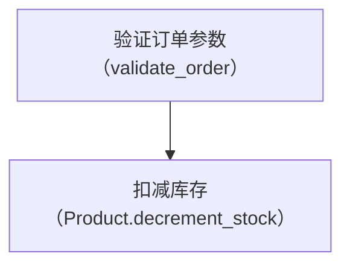

# Component Policy · 组件规范

> **何时读**：Phase 3 每写一个章节时

## 1 · 可用的 reacticle 组件

| 组件 | 用途 | 限制 |
|------|------|------|
| `<Section>` | 每章根组件，必须 | 必须带 `index` 和 `title` props |
| `<p>` | 正文段落 | 自由使用 |
| `<Aside>` | 重点提示/标注 | 用于"业务分析"中的关键推断 |
| `<Raw>` | SVG 流程图、自定义排版 | 见 raw-policy.md |
| `<details>`+`<summary>` | 折叠的完整调用列表 | HTML 原生，直接写在 prose 中 |
| `<Mermaid>` | 调用链流程图、架构图 | 节点文字优先使用中文 |

## 2 · 流程图选择策略

流程图展示方式，按优先级选择：

| 场景 | 推荐方式 | 理由 |
|------|---------|------|
| 1-3 层调用链 | **Mermaid flowchart** | 渲染简洁、自动布局、主题跟随 |
| 4+ 层调用链 | **Mermaid + CallTree 折叠** | Mermaid 画 1-3 核心层，折叠层放完整树 |
| 复杂拓扑/热度图 | **Raw SVG** | Mermaid 无法表达密集网格 |
| 时序/状态转换 | **Mermaid sequenceDiagram** | 时序图 Mermaid 原生支持 |

**原则**：优先选最优雅的方式，不是 Mermaid 或 SVG 二选一。能用 Mermaid 就 Mermaid。

## 3 · 组件使用优先级

```
Mermaid 流程图 → prose → CallTree 折叠 → <Raw> SVG → <Mermaid> 时序图 → <details> 展开
```

## 4 · 禁止的组件和模式

- `<Quote>` 组件（没有引用来源）
- `<CodeBlock>` 代码太长，用 `file:line` 引用替代
- 外部图片（必须是内联 SVG 或 CSS）

## 5 · 流程图中文规范

所有流程图的节点文字以中文为主。函数名/method 名用等宽字附注在中文名旁：

```text
验证订单参数（validate_order）
    ↓
扣减库存（Product.decrement_stock）
```

Mermaid 中写作：

